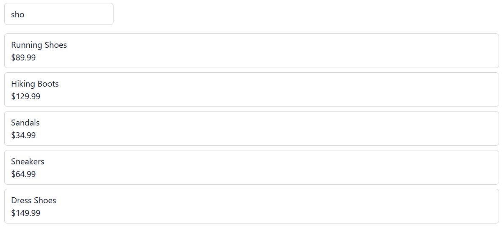

# Product Search — Technical Exercise

Thanks for taking the time to do this. It's a small Angular component —
nothing algorithmic, just something you might see in a real PR review.
We're more interested in how you think through it than whether you land
on the fix immediately, so please talk through your reasoning as you go.

## Setup

```bash
npm ci
npm start
```

Then open the app in your browser and try the search box.

No backend or network access is required — product data is mocked
locally, so this should run with just the two commands above.

## The task

This search feature has a bug where it sometimes shows stale or
out-of-date results.



**Find the cause and fix it.**

If you notice other things you'd improve about how this fires
requests, feel free to call those out too — but the main thing we're
looking for is the stale-results bug.

## Where to look

The relevant code is in:

- `src/app/components/product-search/` — the component and its template
- `src/app/services/product-catalog.ts` — the (mocked) data service it calls

Take whatever time you need — there's no strict clock on this part.